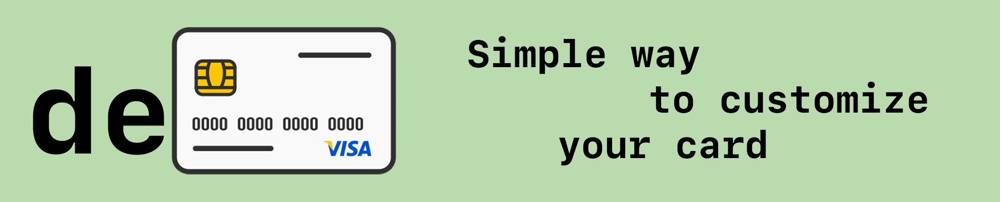
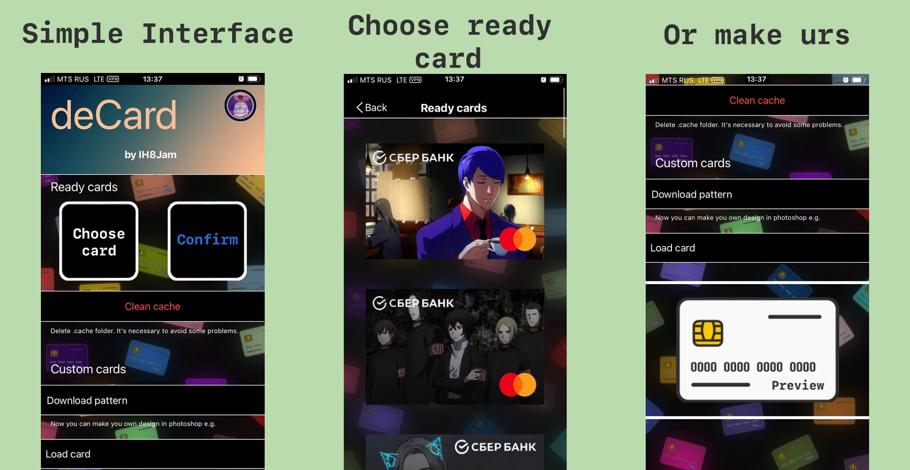
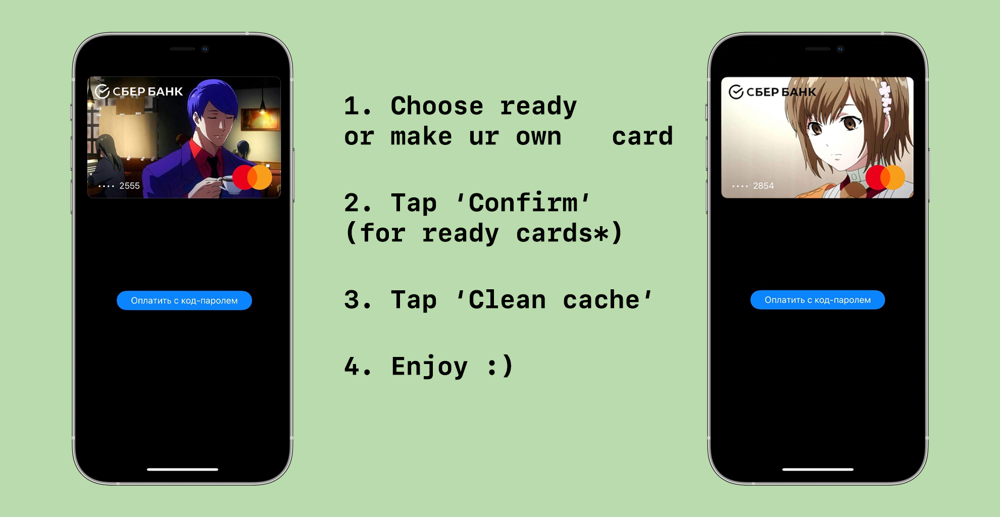

# Preview

# Instruction

# English:

## deCard
Allows you to customize Apple Pay cards. Only for [Jailbreak](https://www.cydiafree.com) users.

### Compiling
  - [Theos](https://theos.dev/) is required to compile the project.
  - You also may use Xcode.

### Compatibility
iPhone running iOS 13.x & 14.x & 15.x

### License
It is forbidden to use this code for commercial purposes. 
If you want to improve this project, then write to the author [@Uncle_Milty](https://t.me/Uncle_Milty) in telegram.

# Russian:

## deCard
Позволяет кастомизировать карты Apple Pay на вашем iPhone. Необходим [Jailbreak](https://www.cydiafree.com) устройства!

### Компиляция   
  - Для компиляции этого твика необходимо установить [Theos](https://theos.dev/).
  - Вы так же можете использовать Xcode.
    
### Совместимость
Данный твик работает на всех iPhone на которых установлена iOS 13.x и выше.

### Лицензия
Запрещается использовать данный проект в коммерческих целях!
Если у вас есть предложения по улучшению, просьба написать автору в телеграм: [@Uncle_Milty](https://t.me/Uncle_Milty)
